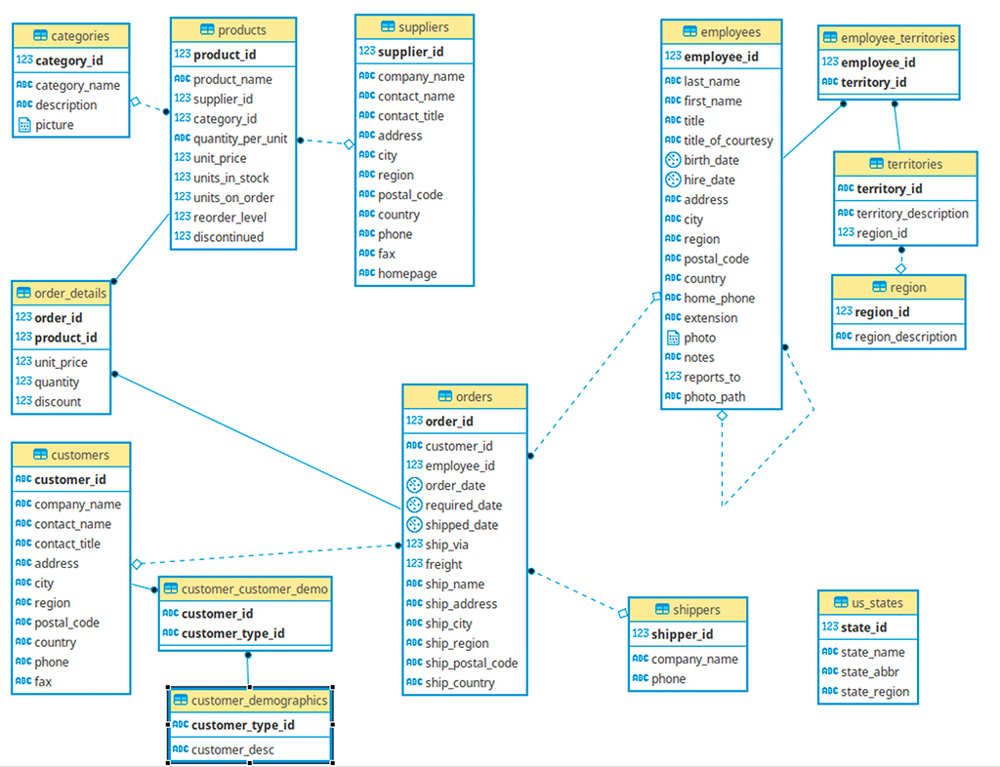

# Tugas Eksplorasi ABD
```markdown
Nama  : Ervina Anggraini  
NRP   : 5026231042  
Kelas : Administrasi Basis Data - A  
Sistem Informasi ITS
```
---

### 1. **Persiapan Database**

link database : https://github.com/pthom/northwind_psql/tree/master
setup user : 
```sql
-- Membuat user A dan user B
CREATE USER user_a WITH PASSWORD 'passwordA';
CREATE USER user_b WITH PASSWORD 'passwordB';

-- Memberikan hak akses ke tabel products
GRANT SELECT, INSERT, UPDATE, DELETE ON products TO user_a;
GRANT SELECT, INSERT, UPDATE, DELETE ON products TO user_b;
```

### 2. **Database Administration**
**Pengertian**:  
Database Administration melibatkan serangkaian tugas untuk mengelola, mengatur, dan memelihara basis data agar berjalan dengan efisien, aman, dan lancar. DBA bertanggung jawab atas performa database, backup dan recovery data, pengelolaan hak akses pengguna, serta memastikan skema database tetap terjaga. Tugas lain termasuk pengaturan indeks, manajemen partisi, pemantauan penggunaan sumber daya, serta menjamin keamanan dan integritas data.

**Contoh**:
- **Membuat indeks** pada tabel **customers** untuk mempercepat pencarian berdasarkan kolom `city`:
  - Tes kecepatan pencarian sebelum diberi index
    ```sql
    EXPLAIN ANALYZE
    SELECT * FROM customers
    WHERE city = 'New York';
    ```
  - Beri index di tabel customer berdasarkan column city
    ```sql
    CREATE INDEX idx_customers_city ON customers(city);
    ```
  - Tes kecepatan pencarian setelah diberi index
    ```sql
    EXPLAIN ANALYZE
    SELECT * FROM customers
    WHERE city = 'New York';
    ```

- **Melakukan Memory Management**

  Memory Management dalam PostgreSQL adalah proses mengoptimalkan penggunaan memori untuk meningkatkan performa basis data. Pengelolaan memori ini melibatkan pengaturan parameter-parameter penting seperti **shared_buffers**, **work_mem**, **maintenance_work_mem**, dan **effective_cache_size**. 
    1. **shared_buffers** :
      Jumlah memori yang dialokasikan PostgreSQL untuk cache halaman data (data pages). Semakin besar nilai ini, semakin banyak data yang bisa disimpan dalam memori tanpa harus mengakses disk. Nilai default biasanya cukup rendah, dan pada sistem dengan RAM yang besar, sebaiknya parameter ini ditingkatkan.

        ```sql
        SHOW shared_buffers;
        ALTER SYSTEM SET shared_buffers = '256MB';
        ```
    2. **work_mem** :
      Jumlah memori yang dialokasikan untuk operasi per query yang membutuhkan memori tambahan, seperti sorting dan hash join. Nilai ini berlaku per operasi, sehingga jika ada banyak operasi simultan, penggunaan memori bisa bertambah secara signifikan.
    
        ```sql
        SHOW work_mem;
        ALTER SYSTEM SET work_mem = '16MB';
        ```

    3. **maintenance_work_mem** :
      Jumlah memori yang dialokasikan untuk operasi maintenance seperti vacuuming, creating indexes, dan lainnya. Menetapkan nilai yang lebih tinggi untuk parameter ini dapat mempercepat operasi maintenance.
      
        ```sql
        SHOW maintenance_work_mem;
        ALTER SYSTEM SET maintenance_work_mem = '128MB';
        ```

    4. **effective_cache_size** :
      Parameter ini tidak secara langsung mengalokasikan memori, tetapi memberi PostgreSQL perkiraan berapa banyak memori sistem yang dapat digunakan untuk caching oleh OS. Ini membantu PostgreSQL dalam membuat keputusan terkait perencanaan query. Semakin besar nilainya, semakin besar PostgreSQL akan menganggap cache yang tersedia, dan query akan dioptimalkan untuk performa yang lebih baik.
      
        ```sql
        SHOW effective_cache_size;
        ALTER SYSTEM SET effective_cache_size = '8GB';
        ```
    5. **Full Code**
        ```sql
        SHOW shared_buffers;
        SHOW work_mem;
        SHOW maintenance_work_mem;
        SHOW effective_cache_size;

        ALTER SYSTEM SET shared_buffers = '256MB';
        ALTER SYSTEM SET work_mem = '16MB';
        ALTER SYSTEM SET maintenance_work_mem = '128MB';
        ALTER SYSTEM SET effective_cache_size = '8GB';

        SELECT pg_reload_conf();
        ```
- **Melakukan Backup dan Restore Database**
    
    Backup dan Restore adalah bagian penting dari pengelolaan database untuk melindungi data dari kegagalan sistem, kerusakan, atau kehilangan data. PostgreSQL menyediakan beberapa metode untuk melakukan backup dan restore, tergantung pada skenario yang dihadapi.

    Untuk Melakukan Backup Database, di CLI ketikkan :
    ```bash
    \! pg_dump -U postgres -d postgres -t customers -t customer_customer_demo -t customer_demographics -Fc -f "[BACKUP_FILE_LOCATION]"
    ```

    Untuk Melakukan Restore Database, di CLI ketikkan :
    ```bash
    createdb -h localhost -U postgres new_database
    pg_restore -U postgres -d new_database "[BACKUP_FILE_LOCATION]"
    ```

- **Mengelola hak akses pengguna** dengan memberikan izin kepada user untuk mengakses data:
  - admin_northwind: bisa melakukan CRUD di tabel order dan employee
    ```sql
    CREATE USER admin_northwind WITH PASSWORD 'password123';
    CREATE ROLE admin_role;
    GRANT SELECT, INSERT, UPDATE, DELETE ON orders TO admin_role;
    GRANT SELECT, INSERT, UPDATE, DELETE ON employees TO admin_role;
    GRANT admin_role TO admin_northwind;
    ALTER USER admin_northwind SET ROLE admin_role;
    ```
  - Sales_northwind: select tabel product, insert dan update table supplier
    ```sql
    CREATE USER sales_northwind WITH PASSWORD 'password123';
    CREATE ROLE sales_role;
    GRANT SELECT ON products TO sales_role;
    GRANT INSERT, UPDATE ON suppliers TO sales_role;
    GRANT sales_role TO sales_northwind;
    ALTER USER sales_northwind SET ROLE sales_role;
    ```
  - Hr_northwind: CRUD di table employee.
    ```sql
    CREATE USER hr_northwind WITH PASSWORD 'password123';
    CREATE ROLE hr_role;
    GRANT SELECT, INSERT, UPDATE, DELETE ON employees TO hr_role;
    GRANT hr_role TO hr_northwind;
    ALTER USER hr_northwind SET ROLE hr_role;
    ```
  - Testing User Permission
    ```sql
    -- 1. admin_northwind 
    -- Test CRUD operations on orders table
    -- Create
    INSERT INTO orders (order_id, customer_id, order_date) VALUES (7777, 'ALFKI', CURRENT_DATE);
    -- Read
    SELECT * FROM orders WHERE order_id = 10280;
    -- Update
    UPDATE orders SET customer_id = 'ANATR' WHERE order_id = 10280;
    -- Delete
    DELETE FROM orders WHERE order_id = 7777;

    -- Test CRUD operations on employees table
    -- Create
    INSERT INTO employees (employee_id, first_name, last_name) VALUES (9999, 'Mario', 'Balotelli');
    -- Read
    SELECT * FROM employees WHERE employee_id = 9999;
    -- Update
    UPDATE employees SET first_name = 'John' WHERE employee_id = 9999;
    -- Delete
    DELETE FROM employees WHERE employee_id = 9999;

    -- Attempt to perform operations on tables that are not permitted
    -- Try to SELECT from products table
    SELECT * FROM products;
    -- Try to INSERT into suppliers table
    INSERT INTO suppliers (supplier_id, company_name, contact_name) VALUES (9999, 'PT Mencari Cinta Sejati', 'Heru');

    -- 2. sales_northwind
    -- Test SELECT operation on products table
    SELECT * FROM products;
    -- Test INSERT and UPDATE operations on suppliers table
    -- Create
    INSERT INTO suppliers (supplier_id, company_name, contact_name) VALUES (9988, 'PT Ahahahaha', 'Mas Kulin');
    -- Update
    UPDATE suppliers SET contact_name = 'Mba Nana';
    -- (Attempting DELETE should fail)
    DELETE FROM suppliers WHERE supplier_id = 9988;

    -- 3. hr_northwind
    -- Test CRUD operations on employees table
    -- Create
    INSERT INTO employees (employee_id, first_name, last_name) VALUES (9998, 'Sultan', 'Razzaqi');
    -- Read
    SELECT * FROM employees WHERE employee_id = 9998;
    -- Update
    UPDATE employees SET first_name = 'Luki' WHERE employee_id = 9998;
    -- Delete
    DELETE FROM employees WHERE employee_id = 9998;
    -- (Attempting SELECT should fail)
    SELECT * FROM orders;
    ```
---

### 3. **Database Transaction**
**Pengertian**:  
Database Transaction adalah unit kerja yang dilakukan dalam satu rangkaian tindakan, di mana semua perintah SQL di dalamnya harus dijalankan sepenuhnya atau dibatalkan seluruhnya jika terjadi kesalahan. Transaksi diatur oleh empat prinsip yang dikenal dengan istilah **ACID**:
- **Atomicity**: Transaksi harus dieksekusi secara keseluruhan atau tidak sama sekali. Jika ada bagian dari transaksi yang gagal, semua perubahan yang telah dilakukan akan dibatalkan.
- **Consistency**: Transaksi harus membawa basis data dari satu keadaan valid ke keadaan valid lainnya. Konsistensi ini dipastikan dengan aturan-aturan seperti constraint atau foreign key.
- **Isolation**: Transaksi harus terisolasi satu sama lain sehingga hasil dari suatu transaksi tidak dapat dipengaruhi oleh transaksi lain yang berjalan bersamaan.
- **Durability**: Setelah transaksi di-commit, hasil dari transaksi tersebut harus permanen, bahkan jika terjadi kegagalan sistem.

**Contoh**:  
Misalkan ada sebuah toko online yang menerima pesanan dari pelanggan. Saat pelanggan memesan 10 unit produk, sistem akan mengurangi stok produk di gudang sebesar 10 unit dan mencatat pesanan baru di tabel orders. Keduanya dilakukan dalam satu transaksi. Jika pengurangan stok dan pencatatan pesanan berhasil, maka transaksi akan di-commit dan perubahan disimpan di database. Namun, jika terjadi kegagalan, misalnya stok tidak bisa diperbarui karena kesalahan sistem, maka seluruh transaksi akan di-rollback, artinya stok dan pesanan tidak akan diubah, sehingga database tetap konsisten dan tidak ada data yang setengah jadi.

```sql
BEGIN; -- Mulai transaksi utama
-- Savepoint pertama
SAVEPOINT sp1;

-- Contoh query pertama
INSERT INTO orders (order_id, customer_id, employee_id, order_date, freight)
VALUES (2001, 'ANATR', 5, '2024-10-14', 100.00);

-- Jika terjadi error, rollback ke savepoint pertama tanpa menggagalkan seluruh transaksi
EXCEPTION WHEN OTHERS THEN ROLLBACK TO sp1;

-- Savepoint kedua
SAVEPOINT sp2;

-- Contoh query kedua
UPDATE products
SET units_in_stock = units_in_stock - 20
WHERE product_id = 3;

-- Jika ada error pada langkah ini, kembalikan hanya ke savepoint kedua
EXCEPTION WHEN OTHERS THEN ROLLBACK TO sp2;

-- Jika semua berhasil, commit transaksi utama
COMMIT;
```
---

### 4. **Concurrency Control**
**Pengertian**:  
Concurrency Control adalah mekanisme yang memastikan bahwa beberapa transaksi yang berjalan secara bersamaan tidak mengganggu satu sama lain, terutama ketika transaksi mengakses atau mengubah data yang sama. Tujuan dari concurrency control adalah menjaga **konsistensi** dan **integritas** data meskipun banyak pengguna atau aplikasi mengakses data secara bersamaan.

Untuk memahami bagaimana **concurrency control** menangani masalah dalam skenario **multi-user**, mari lihat contoh di mana dua pengguna (User A dan User B) mengakses dan memperbarui data yang sama di basis data secara bersamaan. Kita menggunakan tabel **products**, yang menyimpan data stok barang. PostgreSQL menggunakan **locking** dan **transaction isolation levels** untuk mencegah masalah seperti **lost updates**, **uncommitted data**, **inconsistent retrievals**, **phantom reads**, dan **missing/double reads**.

### 1. **Skenario Lost Updates**
Misalkan User A dan User B keduanya mencoba memperbarui stok produk yang sama pada waktu yang bersamaan. Tanpa pengendalian konkurensi, salah satu pembaruan bisa hilang. Berikut adalah contoh cara menggunakan **locking** untuk menghindari masalah ini.

**User A** memulai transaksi untuk menambah stok produk, tetapi belum menyelesaikan transaksinya:

```sql
-- User A
BEGIN;
SELECT units_in_stock FROM products WHERE product_id = 1 FOR UPDATE;  -- Mengunci baris
-- Hasil: units_in_stock = 50

UPDATE products SET units_in_stock = units_in_stock + 10 WHERE product_id = 1;
-- Stok sekarang menjadi 60, tapi belum di-commit
```

**User B** mencoba melakukan pembaruan stok pada produk yang sama saat transaksi **User A** belum di-commit:

```sql
-- User B
BEGIN;
SELECT units_in_stock FROM products WHERE product_id = 1 FOR UPDATE;  
-- Transaksi ini akan menunggu karena baris telah dikunci oleh User A.
```

Setelah **User A** menyelesaikan transaksinya:

```sql
-- User A menyelesaikan transaksi
COMMIT;
```

Sekarang **User B** dapat melanjutkan pembaruan:

```sql
-- User B melanjutkan
UPDATE products SET units_in_stock = units_in_stock - 5 WHERE product_id = 1;
-- Stok sekarang menjadi 55
COMMIT;
```

**Hasil**: Dengan penguncian (`FOR UPDATE`), PostgreSQL memastikan bahwa hanya satu transaksi yang dapat memperbarui stok pada suatu waktu, sehingga tidak ada pembaruan yang hilang.

### 2. **Skenario Uncommitted Data (Dirty Read)**
Dalam skenario ini, **User A** melakukan pembaruan data tetapi belum melakukan **COMMIT**, sementara **User B** mencoba membaca data yang belum dikonfirmasi oleh transaksi **User A**. Jika transaksi **User A** di-rollback, data yang dibaca oleh **User B** menjadi tidak valid (dirty read).

**User A** memulai transaksi untuk memperbarui stok produk:

```sql
-- User A
BEGIN;
UPDATE products SET units_in_stock = 70 WHERE product_id = 1;  -- Belum di-commit
-- Stok sementara menjadi 70
```

Jika **User B** menggunakan level isolasi rendah seperti **READ UNCOMMITTED**, dia bisa membaca data yang belum di-commit oleh **User A**:

```sql
-- User B dengan isolasi READ UNCOMMITTED (biasanya PostgreSQL default READ COMMITTED)
SET TRANSACTION ISOLATION LEVEL READ UNCOMMITTED;

BEGIN;
SELECT units_in_stock FROM products WHERE product_id = 1;  -- Membaca data yang belum di-commit
-- Hasil: 70, meskipun belum di-commit oleh User A
COMMIT;
```

Jika **User A** melakukan **ROLLBACK**:

```sql
-- User A membatalkan transaksi
ROLLBACK;  
-- Stok kembali menjadi 50
```

Data yang dibaca oleh **User B** (70) tidak valid karena perubahan itu dibatalkan.

Untuk mencegah masalah ini, kita bisa menggunakan **READ COMMITTED** sebagai isolasi default di PostgreSQL. Dalam level isolasi ini, **User B** hanya dapat membaca data yang sudah di-commit:

```sql
-- User B dengan isolasi READ COMMITTED
SET TRANSACTION ISOLATION LEVEL READ COMMITTED;

BEGIN;
SELECT units_in_stock FROM products WHERE product_id = 1;  -- Membaca data yang sudah di-commit
-- Hasil: 50 (tidak membaca nilai 70 yang belum di-commit)
COMMIT;
```

### 3. **Skenario Inconsistent Retrievals**
Skenario ini melibatkan dua transaksi di mana **User A** sedang membaca data yang mencakup beberapa baris, sementara **User B** sedang memperbarui beberapa baris dari data yang sama secara bersamaan.

**User A** sedang menghitung total stok dari semua produk:

```sql
-- User A
BEGIN;
SELECT SUM(units_in_stock) FROM products;  -- Total stok dari semua produk
-- Hasil sementara: 150
```

Sementara itu, **User B** sedang memperbarui stok beberapa produk:

```sql
-- User B
BEGIN;
UPDATE products SET units_in_stock = units_in_stock + 10 WHERE product_id = 1;
UPDATE products SET units_in_stock = units_in_stock - 5 WHERE product_id = 2;
COMMIT;
```

Jika **User A** terus menghitung selama **User B** melakukan pembaruan, **User A** mungkin mendapatkan hasil yang tidak konsisten, karena sebagian data sudah diperbarui oleh **User B** sementara data lain belum.

**Solusi**: Dengan menggunakan **REPEATABLE READ**, PostgreSQL memastikan bahwa **User A** selalu melihat snapshot yang konsisten dari data, meskipun ada transaksi lain yang memperbarui data selama transaksi **User A** berlangsung.

```sql
-- User A menggunakan REPEATABLE READ
SET TRANSACTION ISOLATION LEVEL REPEATABLE READ;

BEGIN;
SELECT SUM(units_in_stock) FROM products;  -- Membaca snapshot yang konsisten
-- Hasil: 150, bahkan jika User B memperbarui data secara bersamaan
COMMIT;
```

Dengan **REPEATABLE READ**, PostgreSQL memastikan bahwa **User A** tidak akan melihat perubahan yang dilakukan oleh **User B** hingga transaksi **User A** selesai.

### 4. **Skenario Phantom Reads**
**Phantom Reads** terjadi ketika satu transaksi membaca beberapa baris sesuai dengan kriteria tertentu, kemudian transaksi lain memasukkan atau menghapus baris yang memenuhi kriteria tersebut, sehingga pada pembacaan ulang, transaksi pertama melihat "phantom" atau baris yang sebelumnya tidak ada.

**Contoh Masalah**:
- **User A** menjalankan query untuk membaca semua produk dengan stok lebih dari 100 unit.
- **User B** kemudian menambahkan produk baru dengan stok lebih dari 100 unit.
- Ketika **User A** menjalankan query yang sama, produk baru yang sebelumnya tidak ada muncul sebagai phantom.

**User A** membaca produk dengan stok lebih dari 100 unit:

```sql
-- User A
BEGIN;
SELECT * FROM products WHERE units_in_stock > 100;
-- Hasil: 3 baris
```

**User B** menambahkan produk baru dengan stok lebih dari 100 unit:

```sql
-- User B
BEGIN;
INSERT INTO products (product_id, product_name, units_in_stock) VALUES (5, 'New Product', 150);
COMMIT;
```

Ketika **User A** membaca lagi, baris baru muncul:

```sql
-- User A membaca lagi
SELECT * FROM products WHERE units_in_stock > 100;
-- Hasil: 4 baris (termasuk produk yang ditambahkan oleh User B)
```

**Solusi**: Untuk menghindari **phantom reads**, gunakan level isolasi **SERIALIZABLE**, yang merupakan level isolasi tertinggi dan memastikan bahwa tidak ada transaksi lain yang bisa melakukan **INSERT** atau **DELETE** selama transaksi pertama berlangsung.

```sql
-- User A menggunakan SERIALIZABLE
SET TRANSACTION ISOLATION LEVEL SERIALIZABLE;

BEGIN;
SELECT * FROM products WHERE units_in_stock > 100;
-- Transaksi lain tidak bisa menambah atau menghapus baris hingga transaksi ini selesai
COMMIT;
```

### 5. **Skenario Missing dan Double Reads Akibat Pembaruan Baris**
**Missing Reads** terjadi ketika satu transaksi memperbarui data yang sudah dibaca oleh transaksi lain, tetapi transaksi kedua tidak mendapatkan pembaruan tersebut karena belum menyelesaikan transaksi sebelumnya. **Double Reads** terjadi ketika satu transaksi membaca dua kali data yang sama, tetapi data tersebut berubah di antara dua pembacaan.

**Contoh Masalah**:
- **User A** membaca stok produk.
- **User B** memperbarui stok produk setelah **User A** membacanya.
- Ketika **User A** membaca lagi, stok produk yang baru diperbarui oleh **User B** bisa saja muncul dua kali (double read) atau tidak sesuai.

**Solusi**: Menggunakan level isolasi **REPEATABLE READ** atau **SERIALIZABLE** untuk memastikan bahwa transaksi pertama akan membaca snapshot yang konsisten dari data, dan data yang dibaca tidak berubah selama transaksi berlangsung.

```sql
-- User A menggunakan REPEATABLE READ
SET TRANSACTION ISOLATION LEVEL REPEATABLE READ;

BEGIN;
SELECT * FROM products WHERE product_id = 1;


-- User A akan melihat snapshot yang sama, meskipun User B memperbarui data
COMMIT;
```

Dengan **REPEATABLE READ**, PostgreSQL memastikan bahwa **User A** akan mendapatkan hasil yang konsisten, meskipun transaksi lain memperbarui data selama transaksi berlangsung.

---

Dengan demikian, **concurrency control** menggunakan berbagai teknik seperti **locking** dan **transaction isolation levels** untuk menangani masalah seperti **phantom reads**, **missing/double reads**, **lost updates**, **uncommitted data**, dan **inconsistent retrievals** dalam skenario multi-user.

### Lock Granularity
**Lock Granularity** adalah konsep dalam pengendalian konkurensi yang menunjukkan tingkat atau level di mana penguncian (**lock**) diterapkan di dalam basis data. Semakin halus tingkat penguncian, semakin sedikit area basis data yang dikunci, tetapi lebih banyak biaya kinerja karena pengelolaan lebih banyak kunci. Berikut adalah berbagai level penguncian yang biasa digunakan dalam sistem basis data, termasuk PostgreSQL:

### 1. **Database Level Lock (Penguncian pada Level Basis Data)**
Pada level ini, seluruh basis data dikunci selama transaksi berlangsung. Ini adalah bentuk penguncian paling kasar, di mana satu transaksi akan mengunci seluruh basis data, mencegah transaksi lain mengakses atau memodifikasi bagian mana pun dari basis data selama transaksi tersebut belum selesai.

- **Kelebihan**: Sederhana dan memastikan konsistensi global.
- **Kekurangan**: Efisiensi rendah karena hanya satu transaksi yang bisa berjalan pada satu waktu. Transaksi lain harus menunggu, yang dapat menyebabkan bottleneck di lingkungan multi-user.

**Contoh dalam PostgreSQL**:
```sql
-- Mengunci seluruh database
LOCK DATABASE;
```

### 2. **Table Level Lock (Penguncian pada Level Tabel)**
Pada level ini, satu tabel dikunci selama transaksi berlangsung. Penguncian tabel mencegah transaksi lain untuk mengakses atau memodifikasi tabel tersebut, tetapi transaksi lain masih bisa mengakses tabel yang berbeda.

- **Kelebihan**: Mencegah konflik pada tabel yang sama, lebih efisien daripada mengunci seluruh basis data.
- **Kekurangan**: Tetap menghambat transaksi lain yang hanya ingin bekerja pada sebagian kecil tabel.

**Contoh dalam PostgreSQL**:
```sql
-- Mengunci tabel products untuk mencegah modifikasi oleh transaksi lain
LOCK TABLE products IN EXCLUSIVE MODE;
```

### 3. **Page Level Lock (Penguncian pada Level Halaman)**
Dalam basis data, data sering disimpan dalam blok atau halaman (pages). Pada level ini, satu halaman (blok data dalam disk) dikunci. Setiap halaman berisi beberapa baris data. Page level lock memungkinkan transaksi untuk mengunci satu blok halaman, bukan seluruh tabel.

- **Kelebihan**: Lebih granular dibanding penguncian tabel, memungkinkan lebih banyak transaksi simultan.
- **Kekurangan**: Bisa menyebabkan masalah jika banyak transaksi bekerja pada halaman yang sama, meskipun mereka mengakses baris yang berbeda.

PostgreSQL tidak secara eksplisit mendukung penguncian pada level halaman sebagai fitur yang dapat dipanggil secara langsung oleh pengguna, karena penguncian halaman dilakukan secara internal oleh sistem untuk mengelola disk I/O.

### 4. **Row Level Lock (Penguncian pada Level Baris)**
Penguncian pada level baris memungkinkan satu transaksi mengunci satu baris dalam tabel. Ini memungkinkan lebih banyak fleksibilitas dan simultanitas karena transaksi lain dapat mengakses dan mengubah baris lain di tabel yang sama.

- **Kelebihan**: Lebih granular, sehingga meningkatkan simultanitas dan efisiensi dalam lingkungan multi-user.
- **Kekurangan**: Membutuhkan lebih banyak sumber daya untuk

 mengelola penguncian banyak baris.

**Contoh dalam PostgreSQL**:
```sql
-- Mengunci baris tertentu di tabel products
BEGIN;
SELECT * FROM products WHERE product_id = 1 FOR UPDATE;
```

### 5. **Field Level Lock (Penguncian pada Level Kolom atau Field)**
Penguncian pada level kolom adalah tingkat penguncian yang paling granular, di mana hanya satu kolom (field) dari suatu baris yang dikunci, memungkinkan transaksi lain untuk memperbarui kolom lain pada baris yang sama.

- **Kelebihan**: Penguncian yang sangat halus, memungkinkan simultanitas tingkat tinggi.
- **Kekurangan**: Sangat jarang digunakan karena kompleksitas pengelolaannya. PostgreSQL tidak mendukung penguncian field secara langsung.

**Catatan**: PostgreSQL tidak mendukung penguncian field secara eksplisit. Penguncian ini sering kali dikelola oleh aplikasi pada level yang lebih tinggi, jika diperlukan.

### 6. **Melepaskan Lock**
Untuk membuka atau **membebaskan kunci (unlock)** dalam PostgreSQL, kunci dilepaskan secara otomatis ketika transaksi yang sedang berlangsung selesai dengan salah satu dari dua cara:

1. **COMMIT**: Jika transaksi berhasil dan kita ingin menyimpan semua perubahan yang telah dilakukan, kita menggunakan `COMMIT`. Ini akan melepaskan semua kunci yang dipegang oleh transaksi tersebut.

2. **ROLLBACK**: Jika ada kesalahan atau kita memutuskan untuk membatalkan perubahan yang dilakukan selama transaksi, kita menggunakan `ROLLBACK`. Ini juga akan membatalkan perubahan dan melepaskan semua kunci yang dipegang.

Lock tidak perlu dibebaskan secara manual, karena PostgreSQL secara otomatis menangani pelepasan kunci setelah transaksi selesai dengan `COMMIT` atau `ROLLBACK`

---